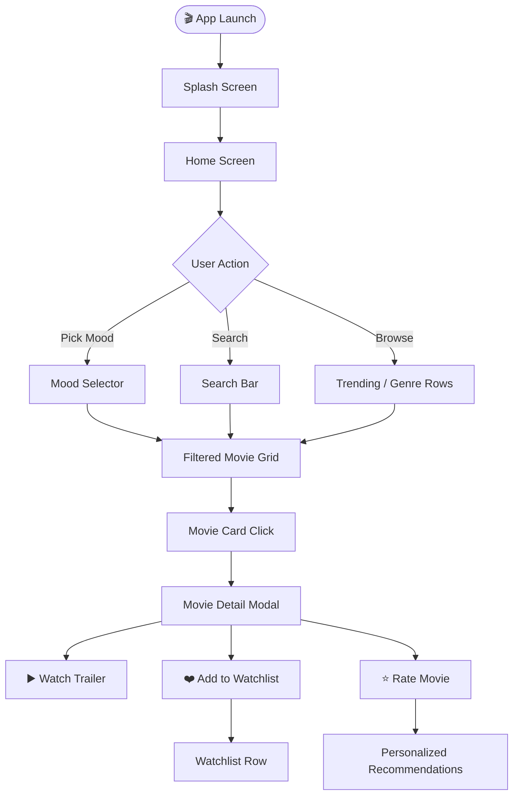
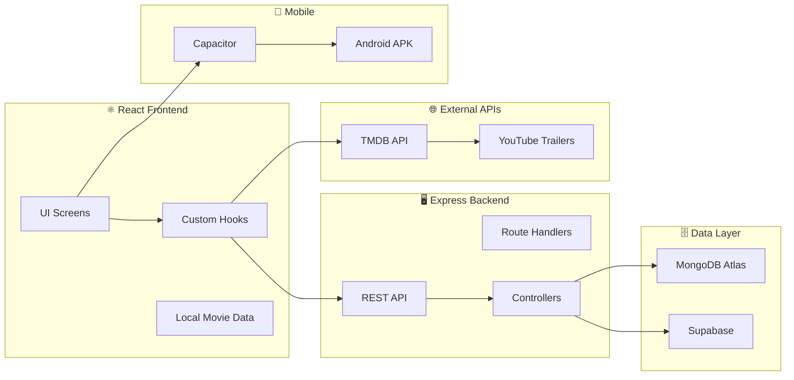
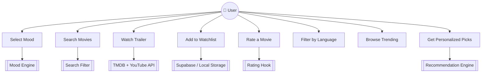

# 🎬 MoodFlix — Mood-Based Movie Discovery App

**MoodFlix** is a full-stack mobile & web application that recommends movies based on how you're feeling. Simply pick your mood and MoodFlix curates the perfect film for your emotional state — with trailers, watchlists, ratings, and more.

---

## ✨ Features

- 🎭 **Mood-Based Recommendations** — 8 moods: Happy, Melancholy, Thrilling, Romantic, Chill, Mysterious, Inspiring, Scary
- 🔍 **Smart Search** — Search movies by title or genre
- 🎞️ **Movie Trailers** — Watch YouTube trailers directly inside the app
- ❤️ **Watchlist** — Save movies to watch later
- ⭐ **Star Ratings** — Rate movies & get personalized recommendations
- 🌍 **Language Filter** — Filter movies by language (English, Hindi, Korean, French & more)
- 📈 **Trending Movies** — Curated trending picks updated dynamically
- 🤖 **Personalized Picks** — AI-style suggestions based on your rating history
- 📱 **Cross-Platform** — Runs as Web App + Android APK (via Capacitor)
- 🗄️ **REST API** — Full Express.js backend with MongoDB & Supabase

---

## 🚀 Tech Stack

| Layer | Technology |
|-------|-----------|
| **Frontend** | React + TypeScript + Vite |
| **UI Components** | shadcn/ui + Tailwind CSS |
| **Animations** | Framer Motion |
| **Backend** | Node.js + Express.js |
| **Database** | MongoDB (Mongoose) + Supabase |
| **Movie Data** | TMDB API |
| **Trailer Streaming** | YouTube (via TMDB) |
| **Mobile** | Capacitor (Android + iOS) |
| **Testing** | Vitest + Playwright |

---

## 🎭 Mood Categories

| Mood | Emoji | Genre Match |
|------|-------|-------------|
| Happy | 😊 | Comedy, Family, Animation |
| Melancholy | 😢 | Drama, Romance |
| Thrilling | ⚡ | Action, Sci-Fi, Thriller |
| Romantic | 💕 | Romance, Drama |
| Chill | 😌 | Indie, Comedy-Drama |
| Mysterious | 🔮 | Mystery, Noir, Psychological |
| Inspiring | 🌟 | Biography, Sport, Drama |
| Scary | 👻 | Horror, Thriller |

---

## 🗺️ App Flow Diagram



---

## 🏗️ Architecture Diagram



---

## 👥 Use Case Diagram



---

## 📁 Project Structure

```
Mood-Flix/
├── src/
│   ├── components/
│   │   ├── MoodSelector.tsx       # Mood picking UI
│   │   ├── MovieCard.tsx          # Individual movie tile
│   │   ├── MovieRow.tsx           # Horizontal scroll row
│   │   ├── MovieDetailModal.tsx   # Full detail + trailer modal
│   │   ├── StarRating.tsx         # Rating component
│   │   ├── SplashScreen.tsx       # Splash screen
│   │   └── ui/                    # shadcn/ui components
│   ├── data/
│   │   ├── movies.ts              # Curated movie dataset
│   │   └── posters.ts             # Poster image map
│   ├── hooks/
│   │   ├── use-watchlist.ts       # Watchlist state management
│   │   ├── use-ratings.ts         # Ratings + recommendations
│   │   └── use-mobile.tsx         # Responsive hook
│   ├── pages/
│   │   ├── Index.tsx              # Main home page
│   │   └── NotFound.tsx           # 404 page
│   ├── integrations/
│   │   └── supabase/              # Supabase client + types
│   └── main.tsx
├── controllers/                   # Express route handlers
│   ├── movieController.js
│   ├── moodController.js
│   ├── watchlistController.js
│   ├── reviewController.js
│   └── ratingController.js
├── models/                        # Mongoose schemas
│   ├── Watchlist.js
│   ├── Review.js
│   └── Rating.js
├── routes/                        # API route definitions
├── config/
│   └── moods.js                   # TMDB mood-genre mapping
├── android/                       # Capacitor Android project
├── server.js                      # Express server entry point
├── db.js                          # MongoDB connection
└── capacitor.config.ts            # Mobile app config
```

---

## 🛠️ How to Run

### 1. Clone the Repository
```bash
git clone https://github.com/bushra-waseem/Mood-Flix.git
cd Mood-Flix
```

### 2. Install Dependencies
```bash
npm install
```

### 3. Set Up Environment Variables
Create a `.env` file in the root directory:
```env
VITE_TMDB_API_KEY=your_tmdb_api_key_here
MONGO_URI=your_mongodb_connection_string
CLIENT_URL=http://localhost:5173
PORT=5000
```

### 4. Run Frontend
```bash
npm run dev
```

### 5. Run Backend (in a separate terminal)
```bash
npm run server
```

### 6. Get TMDB API Key
- Sign up at [themoviedb.org](https://www.themoviedb.org/)
- Go to **Settings → API → Create API Key**
- Paste the key in your `.env` file

---

## 📱 Build Android APK

```bash
# Build the web app
npm run build

# Sync with Capacitor
npx cap sync android

# Open in Android Studio
npx cap open android
```

---

## 🧪 Testing

```bash
# Unit tests
npm run test

# E2E tests (Playwright)
npx playwright test
```

---

## 🌐 API Endpoints

| Method | Endpoint | Description |
|--------|----------|-------------|
| GET | `/api/movies` | Get all movies |
| GET | `/api/moods` | Get mood categories |
| POST | `/api/watchlist` | Add to watchlist |
| GET | `/api/watchlist` | Get watchlist |
| POST | `/api/ratings` | Rate a movie |
| POST | `/api/reviews` | Submit a review |

---

## 👩‍💻 Developer

**Bushra Waseem**

[](https://www.linkedin.com/in/bushraa-waseem)
[](https://github.com/bushra-waseem)

---

> Built with 🎬 React | Node.js | TMDB API | MongoDB | Capacitor
